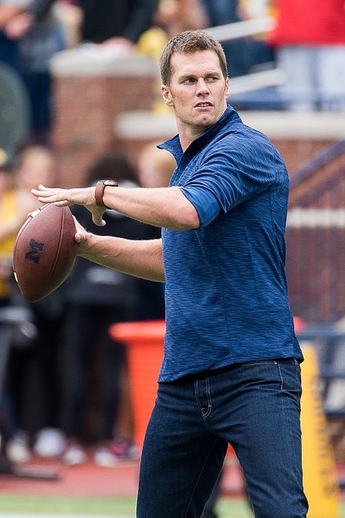
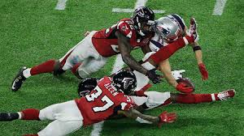
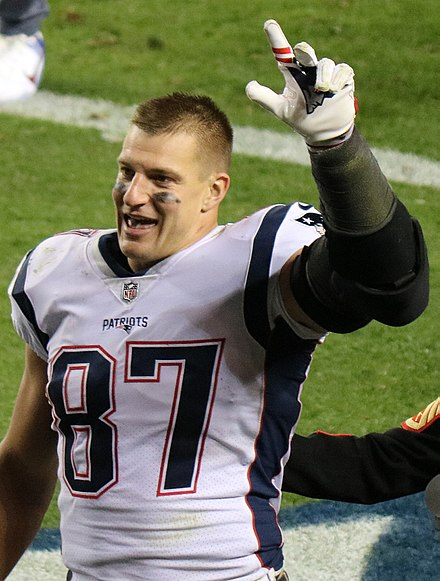

# Great Patriots

###  Josh Whitehouse
January, 31 2018
###### In class assignment 5, CSC 174
Despite a tough loss last night, the Patriots remain an unbelievable team with unbelievable players.  I am incredibly proud of how far they have come and how far they will continue to go.  As always, **Go pats.**

---

My Top Three Favorite Patriots Players.

1. Tom Brady
2. Julian Edelman
3. Rob Gronkowski

### Tom Brady

Thomas Edward Patrick Brady Jr. (born August 3, 1977) is an American football quarterback for the New England Patriots of the National Football League (NFL). He is one of only two players to win five Super Bowls (the other being defensive player Charles Haley) and the only player to win them all playing for one team.

After playing college football for the University of Michigan, Brady was drafted by the Patriots in the sixth round of the 2000 NFL Draft. In Brady's 16 seasons as a starter,[a] he has quarterbacked the Patriots to eight Super Bowl appearances, the most for any player in history.

Brady has been honored with four Super Bowl MVP awards (Super Bowl XXXVI, XXXVIII, XLIX, and LI), the most ever by a single player, has won three league MVP awards (2007, 2010, 2017), has been selected to 13 Pro Bowls, and has led his team to more division titles (15) than any other quarterback in NFL history. As of the end of the 2017 regular season, Brady is fourth all-time in career passing yards, tied for third (with Drew Brees) in career touchdown passes[3], and third in career passer rating. His career postseason record is 27–10, winning more playoff games than any other quarterback, and he has appeared in more playoff games than any player at any position. Brady has never had a losing season as a starting quarterback in the NFL. His combined regular-season and postseason wins are also the most of any quarterback in NFL history. Because of his accomplishments and accolades, many analysts and sportswriters consider Brady to be among the greatest quarterbacks of all time.Due to his late draft selection, Brady is considered to be the biggest "steal" in the history of the NFL Draft.

### Julian Edelman

Julian Francis Edelman (born May 22, 1986) is an American football wide receiver for the New England Patriots of the National Football League (NFL). He played college football at Kent State and the College of San Mateo as a quarterback, and was drafted by the Patriots in the seventh round of the 2009 NFL Draft. He won Super Bowl XLIX and Super Bowl LI with the Patriots.

Edelman is notable for having played both wide receiver and cornerback in 2011, and for his punt returns. He holds the Patriots' franchise record for longest punt return, and the most punts returned for touchdowns with four.

### Rob Gronkowski

Robert Gronkowski (born May 14, 1989) is an American football tight end for the New England Patriots of the National Football League (NFL). He played college football at Arizona, winning several awards, including being named a Sporting News and Rivals.com freshman All-American. The Patriots drafted Gronkowski in the second round of the 2010 NFL Draft with the 42nd pick. In 2011, Gronkowski set the single-season record for touchdowns by a tight end with 17 receiving touchdowns (and 18 overall), as well as the single-season record for receiving yards by a tight end, with 1,327. That season, he became the first tight end in NFL history to lead the league in receiving touchdowns. In his first six seasons, he had 68 receiving touchdowns; only two tight ends in NFL history have had more in their entire careers. He has achieved five Pro Bowl selections and five All-Pro selections, and was a starter in the Patriots' Super Bowl XLIX victory.
